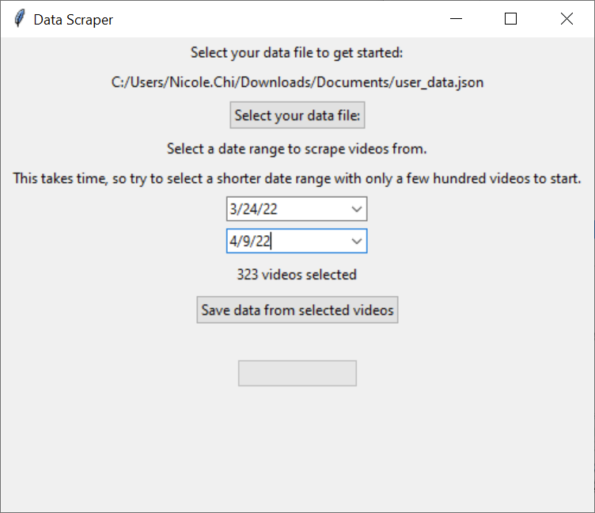
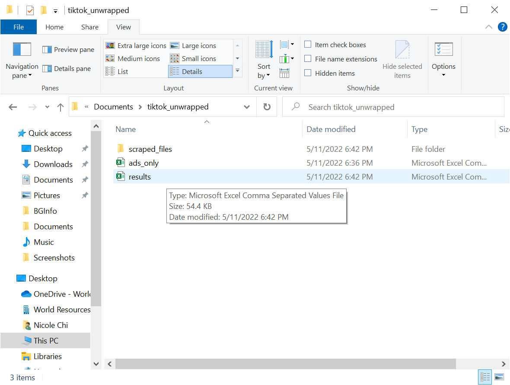

## Data Scraping Tool - PC

To scrape your own TikTok history and do some sensemaking activities of your own, download the relevant app above on your computer and follow the associated instructions.
  

### 1. Opening the app

The link above should download a ".exe" file to your computer. You can put it in any folder you want. Double click it to run. A warning should pop up about an unverified developer; this appears when Microsoft has not taken a look at the app themselves and approved it. Click "more info -> allow anyways" to continue.

It might take a few seconds for the app to load; try again if nothing has happened after 10 seconds. This should show up on your screen!

  

### 2. Selecting the file

Select the "user_data.json" app that you saved from earlier. 

If you select the right file, it should display a date range below, from older date to most recent date, as well as a count of how many videos are stored in your watch history. It might be a lot of videos! This is what your screen should look like now.

  

### 3. Entering a date range

There will be two boxes for you to enter a date in the MM/DD/YY format (M/D/YY works as well). The top date should be older, and the bottom date should be newer. This will allow you to select a "range" of videos to get information for.

You can select with the calendar interface:

Or just manually type the date in.

 Be conservative at first - everyone's internet provider is different, and some might not take kindly to you scraping thousands of videos at once.

  

### 4. Scraping the videos

Click the "scrape videos" button and start downloading videos! Check up on your progress beneath. 

By design, the app will download information for each video *only once*. Every time you try to download information about it again, the app will check to see if you've already saved the information, and if so, will just access the existing saved copy. This allows you to run the app for a while, close it, and come back to it any time - the information you've already saved will still be there. You don't need to worry about spending extra time re-downloading the same video information over and over.

Some videos will not be scrapable because they have been removed/no longer exist, or have been made private. Likewise, if your internet service provider or TikTok decides to block you, the tool will let you know that it is continually running into such errors.

  

### 5. Seeing results

The app will let you know when you're finished, and where the file is stored!

Results will be saved in whatever folder your "user_data.json" file was in. It should look like this:

You can open it with any spreadsheet application such as Microsoft Excel. Not every single video out of the ones selected will be there, since sometimes it'll be removed by TikTok, there can be an internal error on TikTok's side, or you can be blocked by TikTok/your ISP.

*For those interested in running their own analysis:* this apps scrapes *all* available data associated with each video and stores it in the directory where your "user_data.json" file was stored. You can use these files for your own analysis purposes to build data visualizations, machine learning models, other analyses, etc.

